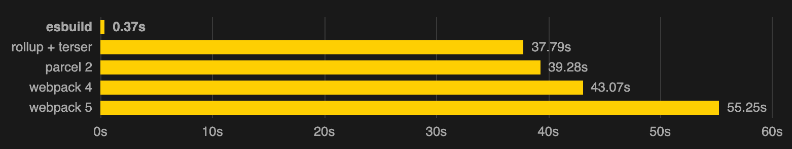

# About the Challenge

## JUMP2DIGITAL

### CARD PRICE CHALLENGE

[Figma resource](https://www.figma.com/file/8DTsCBsanZ0OEoLdiY1qzW/front_creator?node-id=4%3A194)

## Tecnological stack

- [Vite](https://vitejs.dev/) ⚡ (French word for ⚡"quick", pronounced /vit/, like "veet") is a build tool that aims to provide a ⚡faster and leaner development experience for modern web projects. ⛔ creat-react-app, why? 👉 It's slow, just bloody sluggish. Vite, under the hood, runs esbuild to compile the code. 💪 Written in Golang, a compileted language, result: blazing [fast](https://ageek.dev/esbuild) builds 👇 
  - Welcome 🎉💗💓 [Tailwind CSS](https://tailwindcss.com/) works by scanning all of your HTML files, JavaScript components, and any other templates for class names, generating the corresponding styles and then writing them to a static CSS file. It's⚡fast, flexible, and reliable — with zero-runtime. Goodby ⛔Bootstrap yet the bundle size is still too big.

  - [Postcss](https://postcss.org/) 🏎⚡ is used to elimanate the need for a CSS preprocessor and to make it easier to add features like autoprefixing and custom properties. Goodby 🚫SASS. Postcss does tree-shaking; it's used to remove unused code from the bundle.
  - [cssnano](https://cssnano.co/) is used to minify the css.
- [React](https://reactjs.org/)

  - [React Hooks](https://reactjs.org/docs/hooks-intro.html)

- [react-hook-form](https://react-hook-form.com/) Intuitive, feature-complete API providing a seamless experience to developers when building forms. React Hook Form reduces the amount of code you need to write while removing unnecessary re-renders

- [headles ui](https://headlessui.com/):  Completely unstyled, fully accessible UI components, designed to integrate beautifully with Tailwind CSS.


## Documentation just for development purposes.

### How to create a vite project inside a folder already made.

`npm create vite@lates ./`

### How to incorporate tailwind to vite

Install tailwindcss and its peer dependencies via npm, and then run the init command to generate both tailwind.config.cjs and postcss.config.cjs.

```shell
npm install -D tailwindcss postcss autoprefixer
npx tailwindcss init -p
```

### Follow the GUIDE 😜

[Tailwind Guide for Vite](https://tailwindcss.com/docs/guides/vite)

# Eslint 😈

[dev.to](https://dev.to/equiman/vite-powerful-react-project-g4m)

```
npm install -D eslint
npx eslint --init
```

You should disable _JSX transform rule_ by extending react/jsx-runtime in your eslint config (add "plugin:react/jsx-runtime" to "extends").

` "extends": ['plugin:react/recommended', 'standard', 'plugin:react/jsx-runtime']`

And my personal [rules](https://eslint.org/docs/latest/rules/space-before-function-paren):

```javacript
  rules: {
    'no-console': 'warn',
    'react/prop-types': 'off',
    'react/self-closing-comp': 'warn',
    'space-before-function-paren': [
      'error',
      {
        anonymous: 'always',
        named: 'never',
        asyncArrow: 'always'
      }
    ]
  },
```

## Conflict with prettier rules if you're using it as formmater

[Guide](https://github.com/prettier/eslint-config-prettier)

`npm install --save-dev eslint-config-prettier`

And **.eslintrc.cjs**:

` extends: ['plugin:react/recommended', 'standard', 'plugin:react/jsx-runtime', 'prettier']`

### Headless UI

`npm install @headlessui/react`
